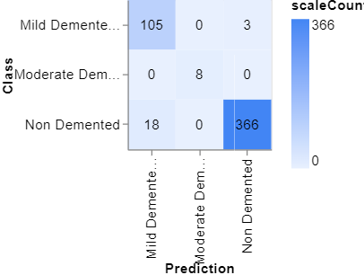
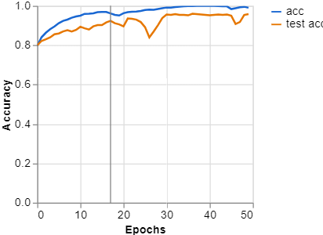
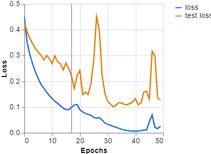

# 🧠 Alzheimer's Disease Detection via Deep Learning

[](https://python.org)
[](https://tensorflow.org)
[](https://keras.io)
[](https://flask.palletsprojects.com)
[](LICENSE)

Deep learning system for Alzheimer's detection from MRI scans using a CNN + SVM hybrid pipeline.

---

## 📋 Overview

This repository provides an automated pipeline for classifying MRI scans into:

| Label | Description |
|-------|-------------|
| **AD** | Alzheimer's Disease |
| **MCI** | Mild Cognitive Impairment |
| **CN** | Cognitively Normal |

The project combines deep learning feature extraction with traditional machine learning classification, structured as a lightweight inference-ready application.

---

## 📁 Project Structure

```
alzheimers-detection/
├── app.py                      # Flask application entrypoint
├── README.md
├── requirements.txt
├── .gitignore
│
├── assets/                     # Training artifacts & visualizations
│   ├── confusion_matrix.png
│   ├── training_accuracy.png
│   └── training_loss.png
│
├── legacy/                     # Older experimental code (archived)
│
├── models/
│   └── Alzhimer_model.h5       # Trained model weights
│
├── notebooks/                  # Jupyter notebooks
│
├── samples/                    # Sample MRI images for testing
│   ├── test1.jpg
│   └── test2.png
│
├── src/
│   ├── model.py                # AlzheimerDetector inference interface
│   ├── preprocess.py           # MRI image preprocessing & resizing
│   └── utils.py                # Model metadata helper utilities
│
├── static/                     # Flask static assets
├── templates/                  # Flask HTML templates
│
└── tests/
    └── test_model.py           # Model prediction validation tests
```

---

## 🔄 Model Pipeline

```
MRI Image
    ↓
Image Preprocessing
    ↓
CNN Feature Extraction
    ↓
SVM Classification
    ↓
Prediction Output
```

---

## 🚀 Installation

### 1. Clone the Repository

```bash
git clone https://github.com/mrudula1501/alzheimers-detection.git
cd alzheimers-detection
```

### 2. Create a Virtual Environment

```bash
python -m venv venv
```

**Activate on macOS/Linux:**
```bash
source venv/bin/activate
```

**Activate on Windows:**
```bash
venv\Scripts\activate
```

### 3. Install Dependencies

```bash
pip install -r requirements.txt
```

---

## ▶️ Run the App

```bash
python app.py
```

Open your browser and navigate to:

```
http://127.0.0.1:5000/health
```

**Expected response:**
```json
{"status": "healthy"}
```

---

## 💡 Example Usage

```python
from src.model import AlzheimerDetector
from src.preprocess import preprocess_image

# Load model
detector = AlzheimerDetector("models/Alzhimer_model.h5")

# Preprocess and predict
image = preprocess_image("samples/test1.jpg")
result = detector.predict("samples/test1.jpg")

print(result)
```

**Example output:**
```json
{
    "prediction": "AD",
    "confidence": 0.94,
    "model_path": "models/Alzhimer_model.h5"
}
```

---

## 🧪 Testing

```bash
pytest tests/
```

---

## 📊 Results

Training artifacts are available in the `assets/` directory:

| File | Description |
|------|-------------|
| `training_accuracy.png` | Accuracy curve across epochs |
| `training_loss.png` | Loss curve across epochs |
| `confusion_matrix.png` | Classification quality per class |

## Sample Training Results

### Confusion Matrix


### Training Accuracy


### Training Loss



---

## 🔮 Future Improvements

- [ ] Replace placeholder inference with the full trained model pipeline
- [ ] Add proper Flask prediction endpoint (`/predict`)
- [ ] Add SHAP / LIME explainability visualizations
- [ ] Add Docker support
- [ ] Add CI/CD via GitHub Actions
- [ ] Move model weights to releases or external storage (e.g., HuggingFace Hub)

---

## 📝 Notes

This repository has been reorganized to separate active project structure from older experimental code, which is stored in `legacy/`.

---

## 📬 Contact

**Mrudula Deshmukh**

[](https://github.com/mrudula1501)
[](https://mrudula1501.github.io/)
[](https://www.linkedin.com/in/dmrudula/)
[](mailto:mrudulad25@gmail.com)
